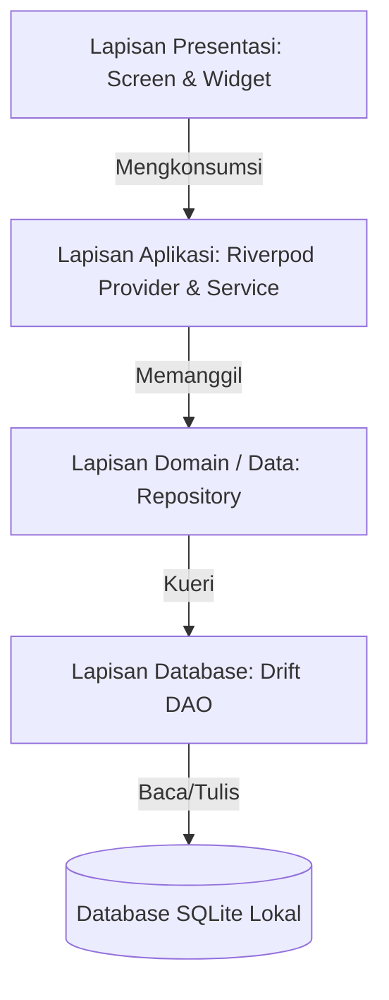

# 🇬🇧 [English](README.md) | 🇮🇩 Bahasa Indonesia

# Money Manager

> Aplikasi manajemen keuangan pribadi yang aman, berorientasi offline-first, dan dibangun menggunakan Flutter. Dirancang khusus untuk pencatatan multi-akun, perencanaan anggaran, dan privasi data mandiri.

[](https://flutter.dev)
[](https://dart.dev)
[](#)
[](LICENSE)

---

## 💡 Mengapa Money Manager? (Nilai Utama)

Sebagian besar aplikasi pencatat keuangan modern mewajibkan koneksi internet, pendaftaran akun cloud pihak ketiga, atau menyimpan riwayat transaksi finansial Anda di server remote. **Money Manager** mengusung pendekatan yang memprioritaskan privasi data:

- **Arsitektur 100% Offline-First**: Menggunakan basis data SQLite lokal ([Drift](https://drift.simonbinder.eu/)), seluruh arus kas, saldo akun, dan catatan pribadi Anda tersimpan secara penuh di perangkat fisik Anda sendiri.
- **Enkripsi Lokal Kuat & Privasi Data**: Dukungan enkripsi kata sandi lokal berbasis AES-256-GCM + HMAC-SHA256 memastikan berkas cadangan (backup) aman dari peretasan dan manipulasi tanpa kata sandi utama Anda.
- **Kepemilikan Data Mandiri (Backup Google Drive Langsung)**: Saat Anda mengaktifkan sinkronisasi cloud opsional, berkas cadangan diunggah langsung ke `appDataFolder` Google Drive milik akun Anda sendiri. Tanpa server perantara, tanpa pelacakan data pihak ketiga, dan bebas biaya berlangganan.

---

## ✨ Fitur Utama

Seluruh fitur di bawah ini telah terimplementasi penuh mulai dari lapisan aplikasi hingga layar UI:

- 💳 **Manajemen Multi-Akun & Dompet** (`lib/features/accounts`)
  Kelola banyak akun tunai, rekening bank, dan e-wallet dengan mata uang khusus, ikon kategoris, kalkulasi saldo otomatis, serta urutan tampilan.

- 💸 **Pencatatan Transaksi & Transfer Antar-Akun** (`lib/features/transactions`, `lib/features/transfers`)
  Catat transaksi pemasukan dan pengeluaran yang dilengkapi fitur pencarian, filter rentang tanggal, dan pengelompokan harian. Lakukan transfer antar-akun dengan mudah.

- 📊 **Perencanaan Anggaran & Target Tabungan** (`lib/features/budgets`, `lib/features/goals`)
  Tetapkan batas anggaran bulanan per kategori dengan indikator visual *real-time*. Buat target tabungan (*savings goals*) yang dilengkapi label prioritas dan fitur setor saldo.

- 🧾 **Pencatatan Hutang & Cicilan** (`lib/features/debts`)
  Pantau piutang maupun hutang yang perlu dibayar, lengkap dengan tanggal jatuh tempo, jumlah cicilan, tanggal penagihan, serta riwayat pembayaran.

- 🔄 **Transaksi Berulang Otomatis** (`lib/features/recurring`)
  Atur jadwal pembayaran rutin harian, mingguan, bulanan, atau tahunan yang terintegrasi dengan notifikasi pengingat lokal.

- 💱 **Multi-Mata Uang & Kurs Penukaran** (`lib/features/currencies`)
  Mendukung transaksi dan akun dalam berbagai mata uang, dilengkapi dengan manajemen nilai tukar mata uang (*exchange rate*).

- 📈 **Statistik & Kalender Interaktif** (`lib/features/statistics`, `lib/features/calendar`)
  Analisis rincian pemasukan vs pengeluaran per periode dan pantau ringkasan pengeluaran harian lewat tampilan grid kalender interaktif.

- 📝 **Catatan Keuangan Ringkas** (`lib/features/notes`)
  Kelola memo dan catatan keuangan ringan berdampingan dengan perencanaan anggaran utama Anda.

- 🔒 **Keamanan Aplikasi & Kunci Biometrik** (`lib/features/security`)
  Lindungi data finansial sensitif menggunakan PIN terenkripsi SHA-256 (*salted hash*), pemblokiran otomatis setelah salah percobaan, otentikasi biometrik (sidik jari / Face ID via `local_auth`), serta penguncian sesi otomatis.

- ☁️ **Backup Lokal & Sinkronisasi Google Drive Terenkripsi** (`lib/features/backup`, `lib/features/settings`)
  Ekspor dan impor cadangan data JSON (terkompresi Gzip) secara lokal, atau sinkronkan langsung ke `appDataFolder` Google Drive pribadi dengan opsi enkripsi AES-256-GCM.

- 🌐 **Dukungan Dua Bahasa (Dua Arah)** (`lib/l10n`)
  Mendukung Bahasa Indonesia dan Bahasa Inggris secara penuh melalui standar `flutter_localizations` (berkas `.arb`).

- 🎨 **Tema Terang & Gelap Adaptive** (`lib/theme`)
  Antarmuka modern dengan skema warna mode gelap dan terang yang dirancang khusus untuk kenyamanan visual dan kontras yang optimal.

---

## 🛠️ Tech Stack

| Lapisan | Teknologi |
|---|---|
| **Framework** | [Flutter](https://flutter.dev) (SDK `>=3.2.0 <4.0.0`) / Dart |
| **Database (ORM)** | [Drift](https://drift.simonbinder.eu/) (SQLite) dengan DAO & Migrasi Skema |
| **State Management** | [Flutter Riverpod](https://riverpod.dev) (`^2.5.1`) |
| **Routing** | [GoRouter](https://pub.dev/packages/go_router) (`^14.0.0`) |
| **Security & Auth** | `local_auth` (Biometrik), `encrypt` (AES-256-GCM), `crypto` (HMAC-SHA256, SHA-256) |
| **Cloud Backup** | `google_sign_in` & `http` (Google Drive REST API v3 `appDataFolder`) |
| **Notifikasi** | `flutter_local_notifications` & `timezone` |
| **Format & L10n** | `intl`, `flutter_localizations` |

---

## 🏗️ Arsitektur

Money Manager menerapkan pola arsitektur **Feature-First Clean Architecture**. Setiap modul fitur memisahkan lapisan data, logika bisnis, dan antarmuka secara terstruktur:



### Struktur Folder Utama

```
lib/
├── core/                  # Utilitas bersama, enkripsi (AES-256/HMAC), konstanta & widget UI
├── database/              # Konfigurasi Drift database, tabel, DAO & migrasi skema
│   ├── daos/              # Data Access Objects (AccountsDao, TransactionsDao, dll)
│   └── tables/            # Skema tabel Drift SQLite (accounts, budgets, debts, dll)
├── data/                  # Implementasi repository yang membungkus Drift DAO
├── domain/                # Entitas bisnis Dart murni, kontrak & service
├── features/              # Modul-modul fitur (Arsitektur Feature-First)
│   ├── accounts/          # Manajemen akun & dompet
│   ├── backup/            # Penanganan backup & restore data
│   ├── budgets/           # Batas anggaran per kategori
│   ├── calendar/          # Grid kalender transaksi
│   ├── categories/        # Kategori pengeluaran & pemasukan
│   ├── currencies/        # Manajemen nilai tukar mata uang
│   ├── dashboard/         # Dashboard ringkasan keuangan
│   ├── debts/             # Manajemen hutang & cicilan
│   ├── goals/             # Pelacakan target tabungan
│   ├── notes/             # Catatan keuangan ringkas
│   ├── recurring/         # Pengelola jadwal transaksi berulang
│   ├── security/          # Pengunci sesi PIN & Biometrik
│   ├── settings/          # Pengaturan aplikasi & integrasi Google Drive
│   ├── statistics/        # Analitik & grafik keuangan
│   ├── transactions/      # Pencatatan transaksi pengeluaran/pemasukan
│   └── transfers/         # Pencatatan transfer antar-akun
├── l10n/                  # Templat lokalisasi bahasa (app_en.arb, app_id.arb)
└── theme/                 # Palet warna & tipografi aplikasi
```

---

## 📷 Tangkapan Layar

<!-- TODO: add screenshots from dashboard, transactions, budgets screens -->

---

## 🚀 Memulai

### Prasyarat

- [Flutter SDK](https://docs.flutter.dev/get-started/install) (`>= 3.2.0`)
- [Dart SDK](https://dart.dev/get-started) (`>= 3.2.0 < 4.0.0`)
- Android Studio / VS Code yang sudah dilengkapi ekstensi Flutter
- Perangkat Android atau Emulator (untuk pengujian seluler) / Windows C++ Build Tools (untuk build desktop)

### Langkah Instalasi

1. **Clone repository**:
   ```bash
   git clone https://github.com/Eliasilyz/Money-Manager.git
   cd "Money Manager"
   ```

2. **Install dependensi**:
   ```bash
   flutter pub get
   ```

3. **Generate kode database & lokalisasi**:
   ```bash
   dart run build_runner build --delete-conflicting-outputs
   ```

4. **Jalankan aplikasi**:
   ```bash
   flutter run
   ```

> ℹ️ **Catatan Backup Google Drive**: Jika melakukan kompilasi build Android dengan fitur Google Drive, pastikan berkas `android/app/google-services.json` Anda telah dikonfigurasi dengan Client ID OAuth 2.0 dan SHA-1 fingerprint dari Google Cloud Console.

---

## 🧪 Menjalankan Pengujian

Project ini dilengkapi dengan *suite test* otomatis yang mencakup pengujian database, fungsi enkripsi, service provider, dan matriks layar UI:

```bash
# Jalankan seluruh unit & widget test
flutter test

# Jalankan pengujian unit spesifik
flutter test test/unit/database_test.dart
flutter test test/unit/crypto_utils_test.dart
flutter test test/unit/backup_service_test.dart

# Jalankan pengujian matriks UI lengkap
flutter test test/ui/screen_matrix_test.dart
```

---

## 🌐 Lokalisasi Bahasa

Menambahkan bahasa baru atau memperbarui terjemahan teks sangat mudah dilakukan:

1. Buka `lib/l10n/app_en.arb` atau `lib/l10n/app_id.arb`.
2. Tambahkan pasangan *key-value* terjemahan sesuai format ARB.
3. Jalankan perintah generator:
   ```bash
   flutter gen-l10n
   ```

---

## 🗺️ Rencana Pengembangan (Roadmap)

- [ ] **Eksekusi Transaksi Berulang Otomatis**: Generasi transaksi otomatis saat aplikasi dibuka jika jadwal transaksi berulang memasuki tanggal jatuh tempo.
- [ ] **Konversi Otomatis Saldo Utama**: Kalkulasi akumulasi saldo bersih di Dashboard lintas mata uang berdasarkan nilai tukar aktif.
- [ ] **Lokalisasi Kategori Default**: Penyesuaian nama kategori bawaan sistem secara otomatis mengikuti bahasa perangkat.
- [ ] **Penyempurnaan CRUD Bottom Sheet**: Edit cepat dan penghapusan item Anggaran serta Target Tabungan via modal bottom sheet.

---

## 🤝 Kontribusi

Kontribusi Anda sangat diapresiasi! Silakan ikuti alur berikut:

1. Fork repository ini.
2. Buat branch fitur Anda (`git checkout -b feature/FiturKeren`).
3. Commit perubahan Anda (`git commit -m 'Menambahkan FiturKeren'`).
4. Pastikan analisa statis dan test lulus (`flutter analyze && flutter test`).
5. Push ke branch Anda (`git push origin feature/FiturKeren`).
6. Buat Pull Request baru.

---

## 📄 Lisensi

Didistribusikan di bawah lisensi **GNU Affero General Public License v3.0 (AGPL-3.0)**. Lihat berkas [`LICENSE`](LICENSE) untuk informasi lebih lanjut.
