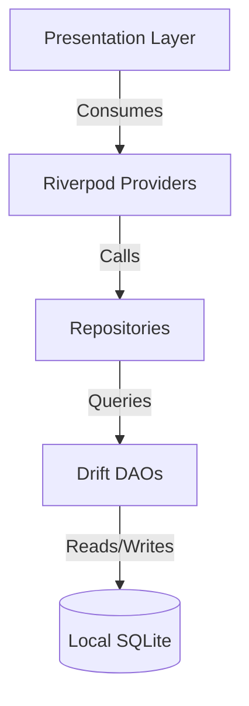

# 🇬🇧 English | 🇮🇩 [Bahasa Indonesia](README.id.md)

# Money Manager

> A secure, offline-first personal finance management application built with Flutter, designed for multi-account tracking, budget planning, and privacy-focused data ownership.

[](https://flutter.dev)
[](https://dart.dev)
[](#)
[](LICENSE)

---

## 💡 Why Money Manager? (Value Proposition)

Most modern money-tracking applications mandate active internet connectivity, third-party user account registration, or store your financial records on remote cloud servers. **Money Manager** takes a privacy-first approach:

- **100% Offline-First Architecture**: Powered by a local SQLite database ([Drift](https://drift.simonbinder.eu/)), all your cash flows, account balances, and personal records remain strictly on your physical device.
- **Strong Encryption & Privacy**: Support for local AES-256-GCM + HMAC-SHA256 password encryption ensures your exports and backups are tamper-proof and inaccessible without your master password.
- **Own Your Data (Direct Google Drive Backup)**: When you choose to sync your data to the cloud, backup files are uploaded directly to your own personal Google Drive `appDataFolder`. No middleman servers, no third-party database tracking, and zero subscription traps.

---

## ✨ Key Features

All features listed below are fully implemented across application layers and presentation screens:

- 💳 **Multi-Account & Wallet Management** (`lib/features/accounts`)
  Manage multiple cash, bank, and e-wallet accounts with customized currencies, typed icons, balance recalculation, and sort orders.

- 💸 **Transactions & Inter-Account Transfers** (`lib/features/transactions`, `lib/features/transfers`)
  Log income and expense transactions with search, date-range filtering, and daily groupings. Seamlessly execute transfers between accounts.

- 📊 **Budgeting & Savings Goals** (`lib/features/budgets`, `lib/features/goals`)
  Set category-specific monthly spending limits with real-time visual progress indicators. Create savings goals with priority tags and direct balance deposits.

- 🧾 **Debt & Installment Tracking** (`lib/features/debts`)
  Track money owed to or by you, complete with due dates, installment counts, billing days, and full payment history logs.

- 🔄 **Recurring Transactions** (`lib/features/recurring`)
  Configure daily, weekly, monthly, or yearly recurring payments and scheduled bills with automated local reminders.

- 💱 **Multi-Currency & Exchange Rates** (`lib/features/currencies`)
  Supports transactions and accounts in different currencies, featuring an exchange rate registry for multi-currency conversion.

- 📈 **Statistics & Interactive Calendar** (`lib/features/statistics`, `lib/features/calendar`)
  Analyze monthly income vs. expense breakdowns by category and view daily spending dots on an interactive calendar grid.

- 📝 **Notes & Financial Memos** (`lib/features/notes`)
  Keep lightweight financial notes and memos integrated alongside your overall financial tracking.

- 🔒 **App Security & Biometric Lock** (`lib/features/security`)
  Protect sensitive financial data using a salted SHA-256 PIN hash with anti-bruteforce lockout, biometric authentication (Fingerprint / Face ID via `local_auth`), and automatic session locking.

- ☁️ **Local Backup & Encrypted Google Drive Sync** (`lib/features/backup`, `lib/features/settings`)
  Export and import Gzipped JSON backups locally or upload directly to your personal Google Drive `appDataFolder` with optional AES-256-GCM password encryption.

- 🌐 **Bilingual Localization** (`lib/l10n`)
  Native support for English and Bahasa Indonesia via standard `flutter_localizations` (`.arb` templates).

- 🎨 **Adaptive Dark & Light Theme** (`lib/theme`)
  Custom-designed interface with light and dark mode palettes built for high contrast and readability.

---

## 🛠️ Tech Stack

| Layer | Technology |
|---|---|
| **Framework** | [Flutter](https://flutter.dev) (SDK `>=3.2.0 <4.0.0`) / Dart |
| **Database (ORM)** | [Drift](https://drift.simonbinder.eu/) (SQLite) with DAOs & Migration Strategies |
| **State Management** | [Flutter Riverpod](https://riverpod.dev) (`^2.5.1`) |
| **Routing** | [GoRouter](https://pub.dev/packages/go_router) (`^14.0.0`) |
| **Security & Auth** | `local_auth` (Biometrics), `encrypt` (AES-256-GCM), `crypto` (HMAC-SHA256, SHA-256) |
| **Cloud Backup** | `google_sign_in` & `http` (Google Drive REST API v3 `appDataFolder`) |
| **Notifications** | `flutter_local_notifications` & `timezone` |
| **Formatting & L10n** | `intl`, `flutter_localizations` |

---

## 🏗️ Architecture

Money Manager follows a **Feature-First Clean Architecture** design pattern. Each domain module isolates its data, business logic, and presentation concerns:



### Folder Structure Overview

```
lib/
├── core/                  # Shared utilities, crypto (AES-256/HMAC), constants & reusable UI widgets
├── database/              # Drift database configuration, tables, DAOs & migrations
│   ├── daos/              # Data Access Objects (AccountsDao, TransactionsDao, etc.)
│   └── tables/            # Drift SQLite table schemas (accounts, budgets, debts, etc.)
├── data/                  # Repository implementations wrapping Drift DAOs
├── domain/                # Pure Dart business entities, contracts & services
├── features/              # Feature modules (Feature-First architecture)
│   ├── accounts/          # Account & wallet management
│   ├── backup/            # Data backup & restore handlers
│   ├── budgets/           # Category budget limits
│   ├── calendar/          # Interactive transaction grid
│   ├── categories/        # Income & expense categories
│   ├── currencies/        # Exchange rate management
│   ├── dashboard/         # Financial summary dashboard
│   ├── debts/             # Debt & installment management
│   ├── goals/             # Savings target tracking
│   ├── notes/             # Quick financial notes
│   ├── recurring/         # Recurring schedule manager
│   ├── security/          # PIN & Biometric session lock
│   ├── settings/          # App settings & Google Drive integration
│   ├── statistics/        # Analytics & charts
│   ├── transactions/      # Income/Expense transaction logging
│   └── transfers/         # Inter-account transfer logging
├── l10n/                  # Localization templates (app_en.arb, app_id.arb)
└── theme/                 # App color palettes & typography definitions
```

---

## 📷 Screenshots

<!-- TODO: add screenshots from dashboard, transactions, budgets screens -->

---

## 🚀 Getting Started

### Prerequisites

- [Flutter SDK](https://docs.flutter.dev/get-started/install) (`>= 3.2.0`)
- [Dart SDK](https://dart.dev/get-started) (`>= 3.2.0 < 4.0.0`)
- Android Studio / VS Code with Flutter extensions
- Android device or emulator (for mobile testing) / Windows C++ Build Tools (for desktop build)

### Installation Steps

1. **Clone the repository**:
   ```bash
   git clone https://github.com/Eliasilyz/Money-Manager.git
   cd "Money Manager"
   ```

2. **Install dependencies**:
   ```bash
   flutter pub get
   ```

3. **Generate database code & localizations**:
   ```bash
   dart run build_runner build --delete-conflicting-outputs
   ```

4. **Run the application**:
   ```bash
   flutter run
   ```

> ℹ️ **Google Drive Backup Note**: If building for Android with Google Drive integration, ensure your `android/app/google-services.json` file is correctly configured with your Google Cloud Console OAuth 2.0 Client ID and SHA-1 fingerprint.

---

## 🧪 Running Tests

The repository maintains an extensive automated test suite covering core database operations, encryption routines, service providers, and UI screen matrices:

```bash
# Run all unit and widget tests
flutter test

# Run specific unit test suites
flutter test test/unit/database_test.dart
flutter test test/unit/crypto_utils_test.dart
flutter test test/unit/backup_service_test.dart

# Run full UI screen matrix test
flutter test test/ui/screen_matrix_test.dart
```

---

## 🌐 Localization

Adding a new language or updating translation strings is straightforward:

1. Open `lib/l10n/app_en.arb` or `lib/l10n/app_id.arb`.
2. Add your localized key-value pairs following ARB format guidelines.
3. Run code generation:
   ```bash
   flutter gen-l10n
   ```

---

## 🗺️ Roadmap

- [ ] **Automated Schedule Execution**: Automatic transaction generation on app startup when recurring schedules reach due date.
- [ ] **Enhanced Base Currency Conversion**: Automatic multi-currency net balance aggregation on Dashboard using active exchange rates.
- [ ] **Locale-Aware Default Categories**: Automatic localization of seed categories matching device system language.
- [ ] **Refined Bottom Sheet CRUD**: Quick inline editing and deletion for Budgets and Savings Goals via modal bottom sheets.

---

## 🤝 Contributing

Contributions are welcome! Please follow these guidelines:

1. Fork the repository.
2. Create your feature branch (`git checkout -b feature/AmazingFeature`).
3. Commit your changes (`git commit -m 'Add some AmazingFeature'`).
4. Ensure all static checks and tests pass (`flutter analyze && flutter test`).
5. Push to the branch (`git push origin feature/AmazingFeature`).
6. Open a Pull Request.

---

## 📄 License

Distributed under the **GNU Affero General Public License v3.0 (AGPL-3.0)**. See [`LICENSE`](LICENSE) for details.
